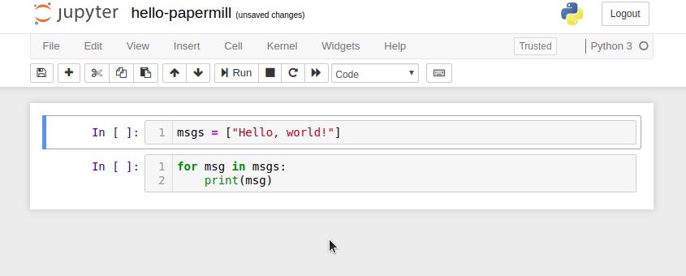
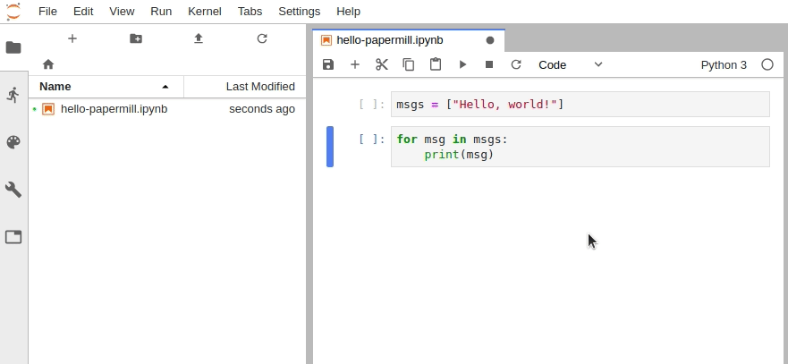
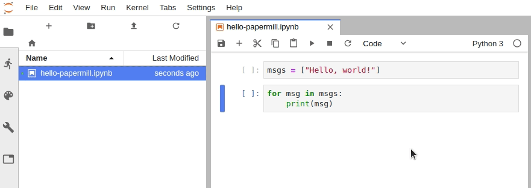
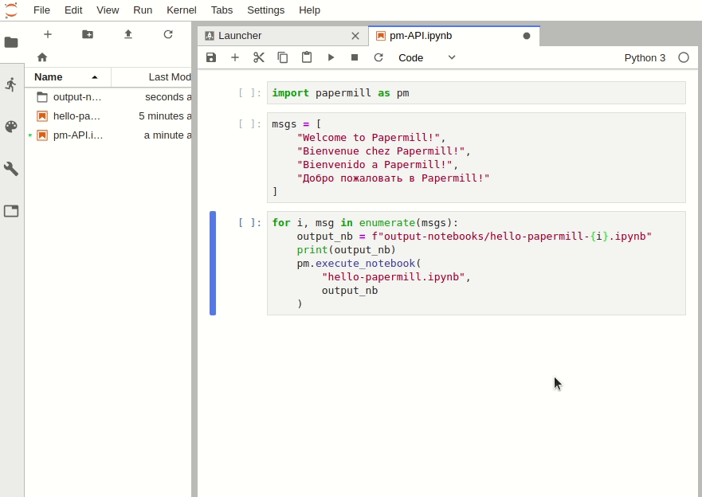

# An introduction to the `papermill` package

## (and the `scrapbook` package if we have time...)

Check out the repo on GitHub by clicking the icon below:
> <a href="https://github.com/nteract/papermill"></a>
>
> <!---(binder links generated at https://mybinder.readthedocs.io/en/latest/howto/badges.html and compressed at https://tinyurl.com) -->
> [](https://travis-ci.org/nteract/papermill)
> [](https://codecov.io/github/nteract/papermill?branch=master)
> [](http://papermill.readthedocs.io/en/latest/?badge=latest)
> [](https://mybinder.org/v2/gh/nteract/papermill/master?filepath=binder%2Fprocess_highlight_dates.ipynb)
> [](https://mybinder.org/v2/gh/nteract/papermill/master?filepath=binder%2Fcli-simple%2Fcli_example.ipynb)
> [](https://github.com/ambv/black)
>
> **papermill** is a tool for parameterizing, executing, and analyzing Jupyter Notebooks.
>
> Papermill lets you:
>
> -   **parameterize** notebooks
> -   **execute** notebooks

## Before we begin

This walk-through assumes you have `conda` installed. If you do not, consider installing it for your operating system following the directions [here](https://conda.io/projects/conda/en/latest/user-guide/install/index.html#regular-installation).

### Set up a new `conda` environment

Any time you want to try out a new Python package, I would highly recommend testing them in a separate `conda` environment. We can create a new environment called `papermill` and install `python` (version `3.6`) into that environment using the following command.

```bash
conda create -n papermill python=3.6
```

(**_Note:_** You can omit the version number, which will install whatever `python` version is used in your `base` environment. Papermill should work perfectly well with `python=3.5`, `3.6`, or `3.7`.)

### Activate environment and install packages

For the examples shown in this walk-through, we're going to install `papermill`, `jupyterlab`, `gplearn`, and `scikit-learn` into our new environment.

```bash
conda activate papermill
pip install tornado==5.1.1 papermill nteract-scrapbook jupyterlab  # See note below
pip install tensorflow tensorflow-datasets matplotlib
```

Unfortunately, as of writing (4 March 2019), `pip install papermill` will pull in the latest version of `jupyter` and the latest version of `tornado`. However, `tornado==6.0.1` (released 3 March 2019) is not compatible with `jupyter` at this time. Instead, we must pin `tornado` to version `5.1.1`. (Check the [tornado releases page](https://www.tornadoweb.org/en/stable/releases.html) and [this GitHub issue](https://github.com/jupyter/notebook/issues/4399) to see if this problem has been resolved by now.)

### Setting up Jupyter Notebook and JupyterLab for use with `papermill`

In Jupyter Notebook, configure the cell toolbar to display cell tags by navigating to `View -> Cell Toolbar -> Tags`.



In JupyterLab, you must manually edit the metadata by navigating to `Cell Inspector (Wrench Icon) -> Edit Metadata`, then insert the following:

```json
{
    "tags": [
        "parameters"
    ]
}
```



Alternatively, install the `jupyterlab/celltags` extension.

```
jupyter labextension install @jupyterlab/celltags
```

(**_Note:_** labextensions require `node.js`. This can be installed separately or, if Jupyter is installed within a `conda` environment, it can be installed into the same environment with `conda install nodejs`.)



This is useful for more than enabling papermill parameters. See the repo on [GitHub](https://github.com/jupyterlab/jupyterlab-celltags).

**_Recommended:_** install `ipywidgets` and the JupyterLab extension `jupyter-widgets/jupyterlab-manager` to enable progress bars in JupyterLab when using the Papermill Python API.

```bash
conda activate papermill
pip install ipywidgets
jupyter nbextension enable --py widgetsnbextension
jupyter labextension install @jupyter-widgets/jupyterlab-manager
```



Learn more about extensions for JupyterLab in the [documentation](https://jupyterlab.readthedocs.io/en/stable/user/extensions.html), or find other extensions by [browsing the topic on GitHub](https://github.com/topics/jupyterlab-extension?o=desc&s=stars).


### What is parametrization?

I'm going to take a stab at this in my own words. Parametrization is the process of identifying components of a system which can be modified while still preserving the general character of the system. For example, the linear function `y = 3x + 1` can be modified by changing the slope `3` or the intercept `1` to different values while still being a linear function; as a result, we call the slope and intercept _parameters_ of the function `y`.


### Why should I be interested in parametrizing a notebook?

Parametrization is ubiquitous among computer programs. Python scripts can be parametrized using command-line arguments (modules such as `argparse` simplify this process) or by prompting the user for input. Functions are frequently parametrized using keyword arguments. As such, you might think, "Why would I want to parametrize a notebook instead of writing a normal Python script or a (possibly large) function that performs the exact same task?"

Other than the fact that many people enjoy working in notebooks for rapid prototyping, Jupyter Notebooks are built for visualization. In addition, they make data vizualization

1. convenient: no need to save results in intermediate files;
2. reproducible: the notebook is a precise record of how a visualization was produced;
3. portable: under the hood, notebooks are pure JSON (light-weight and parsable); and
4. distributable: notebooks can be _easily_ converted to HTML or PDF, or distributed in their default `ipynb` form.

So, if your program depends on or would benefit from visualization within a notebook, you can go one step farther by parametrizing that notebook. This may allow you to repoduce your visualization

1. periodically: passing in the latest data each time (e.g. annual reports);
2. "horizontally": applying the same analysis to different inputs (e.g. stock price analysis of different companies); or
3. "vertically": applying a slightly different analysis to the same input (e.g. testing different neural networks on the same task)


## Create a parametrized notebook

In practice, you will have already created a notebook that you now want to parametrize. However, for the sake of illustration, we're going to define our parameters first, then write some code which uses our parameters to generate some output.

To parametrize our notebook, we must

1. Designate a single cell with the tag `parameters`. (**_Note:_** This cell need not be the first cell in the notebook, but should be located above any cell which depends on the parameters.)
2. Define some parameters within the designated cell and give them default values.

## Execute a Notebook

There are two ways to execute notebooks:

1. through the Python API (`import papermill as pm`), or
2. from the command line

### Python API:

The Python API can be used to intuitively iterate over any number of parameter combinations.
```python
import papermill as pm

for i in [1, 2, 3]:
    for j in [10, 20, 30]:
        pm.execute_notebook(
            "multiple-params.ipynb",
            f"output-notebooks/multiple-params-{i}{j}.ipynb",
            parameters = dict(int1=i, int2=j)
        )
```

### Command-line interface:

Suppost you have multiple YAML files, each specifying a particular set of parameters you want to execute with. The following command will run papermill on each parameter file and inject the name of that parameter file into the output notebook's filename.
```bash
ls *.yaml | xargs -n1 -I {} papermill -f {} input.ipynb output/output-{}.ipynb
```

You can also create nested `for` loops in `bash` to specify a grid of parameters on which to execute.
```bash
for i in 1 2 3; do
    for j in 4 5 6; do
        papermill input.ipynb output/output$i$j.ipynb -p p1 $i -p p2 $j;
    done;
done;
```

## Can we only parametrize numbers, strings, lists, dicts?

## Example use cases
1. Hyperparameter search for MNIST-trained CNN
    1. Possible parameters:
        1. network depth
        1. loss function
        1. convolution parameters
            1. kernel size
            1. kernel initializer
            1. kernel regularizer
            1. padding
            1. activation
            1. data format (may affect training wall-time)
            1. use bias / bias initializer
        1. use augmentation
        1. use batch norm
        1. use dropout
        1. dropout probability
        1. layer order (conv -> BN -> activation)
        1. flatten -> dense vs GAP -> dense
    1. Visualization:
        1. network diagram
        1. weights (histograms / normalized, single channel imshow)
        1. image at each layer
        1. metrics over time
        1. cross-validation results (mean and variance)
        1. failure analysis

1. Company / Sector stock market analysis
    1. Parameters:
        1. company name / ticker symbol / sector label
        1. time interval
    1. Visualization:
        1. stock price
        1. trading volume
        1. headlines (web-scraped)
            1. reported earnings
            1. price split
            1. dividends
            1. acquisitions
        1. sentiment analysis
        1. performance against previous year(s)
        1. performance against companies in same sector

1. Genetic Programming (specifically with `gplearn`)
    1. Parameters:
        1. target function (pickled!)
        1. function set
        1. many hyperparameters, e.g. mutation probabilities
    1. Visualization:
        1. fitness vs population size (fixed # generations)
        1. fitness over time (fixed pop. size)
        1. average program size over time (fixed pop. size)
        1. wall-time-per-generation over time
